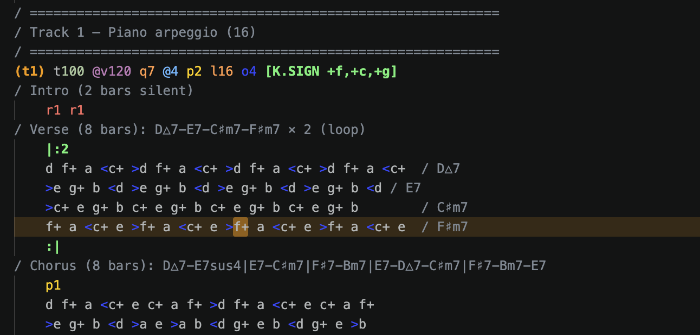
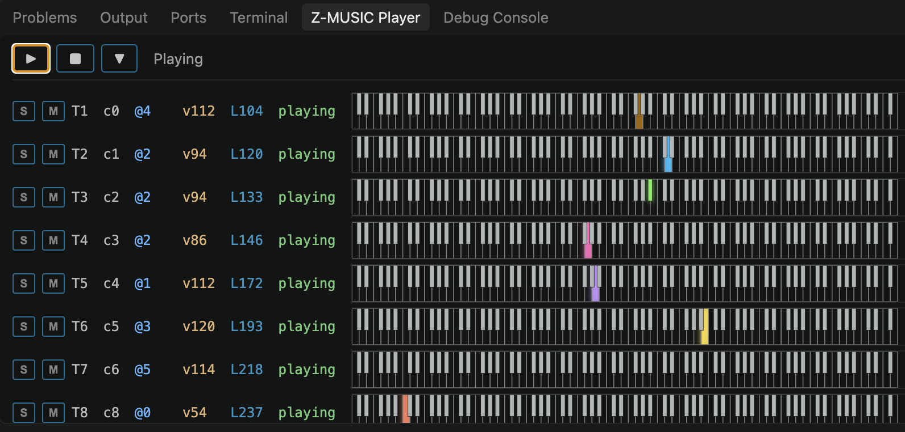
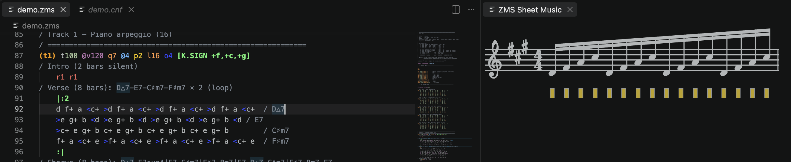
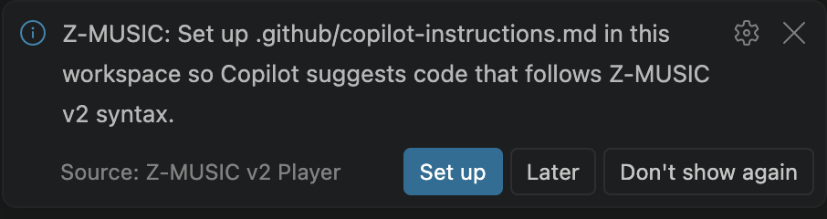

# vscode-zms — Z-MUSIC v2 Player for VS Code

SHARP X680x0 の Z-MUSIC v2.08 用 MML (`.zms`) を VS Code で編集・**その場で再生**・**演奏位置をエディタでハイライト追従**するための拡張

再生エンジンは toyoshim/z-music.js を fork した WASM で、実機 X68000 のドライバ `ZMUSIC.X` を run68 (68000 エミュ) 上で走らせています。FM (OPM 8ch) と ADPCM が再生可能です

## スクリーンショット

<!--
撮影ガイド (Marketplace 公開前に埋める。TAGAYA が実施):
  1. VS Code Reload Window → samples/demo.zms を開く (Golden Cadence — A major 王道進行、
     8 トラック FM+ADPCM のオリジナル曲。詳細は samples/demo.md)
  2. F5 → QuickPick で ZMUSIC.X 選択 → 再生
  3. 以下の 4 枚を docs/screenshots/ 以下に .png で保存し、下の
      リンクを実パスに置換。
-->

- **エディタ + シンタックスハイライト**: 音符=白 / 休符=赤 / 音量=橙 /
  パンポット=黄 / フロー制御=黄緑 bold / オクターブ=青 / トラック prefix
  `(t1)` はパレット色。演奏中の音符は該当トラックの palette 色でハイライト
  
- **Player パネル** (Z-MUSIC Player view): トラックごとに Solo/Mute ボタン、
  音色 `@n`、音量 `vNN`、現在演奏中の ZMS 行 `LNN`、mmdsp テイストのMIDI 128 鍵盤ビジュアライザ
  
- **abcjs 譜面プレビュー**: MML → 譜面表示。現在ノートを楽譜上でトラックパレット色にハイライト
  
- **Copilot Setup 通知**: 初回 `.zms` オープン時、Z-MUSIC v2 用の Copilot
  instructions を workspace に配置するかを案内
  

## 機能

- **シンタックスハイライト** (`.zms` 拡張子、言語 ID `zms`)
- **ホバー**: MML コマンド (`@V`, `@U`, `[~]`, etc.) の説明
- **静的リント**: パラメータ範囲・括弧バランスに加えて、**FM 音色定義の 55/56 パラメータ数**を厳密検証 (Copilot 等が生成する Form 1/2 混合形の書式ミスを Problems パネルで即警告)
- **コード補完**: `@` `(` `.` `[` トリガの CompletionItemProvider + 定型スニペット (`zmsinit`, `voice`, `malloc`, `assign`, `loop`, `chord`)
- **F5 で発音**: エディタの現在内容 (未保存分含む) を SJIS+CRLF 化して WASM ドライバに投入、`m_play` で再生
- **Shift+F5 でカーソル位置から再生**: 無音早送りで指定 step に到達してから発音
- **演奏位置トレース**: 各トラックの `p_data_pointer` を 30Hz で読み、対応する MML ソース範囲を色分けハイライト
- **Player ビュー詳細表示**: 各トラック行に音色番号 `@n`・音量 `vNN`・現在演奏中の ZMS 行 `LNN` を live 表示
- **Solo / Mute**: トラック行の S / M ボタンで単一トラックの独占再生・消音。ファイル単位で `workspaceState` に永続化 (次回開いても復元)
- **abcjs 譜面プレビュー**: 別ウィンドウの Show Sheet Music コマンド。現在ノートがトラックのパレット色で染色されて追従
- **Copilot 連携**: Z-MUSIC v2 の書式ルールを Copilot に伝える `.github/copilot-instructions.md` を配置するコマンド。詳細は下記「Copilot 統合」節参照

## キーバインド

| コマンド | 既定キー (`.zms` 編集時) | 説明 |
| --- | --- | --- |
| `Z-MUSIC: Compile & Play` | `F5` | 現在のエディタ内容を再生 |
| `Z-MUSIC: Play from Cursor` | `Shift+F5` | カーソル位置から再生 |
| `Z-MUSIC: Stop` | `F9` | 停止 |
| `Z-MUSIC: Fade Out` | `Shift+F9` | フェードアウト |
| `Z-MUSIC: Toggle Trace` | `Ctrl+F5` / `Cmd+F5` | 追従ハイライトの ON/OFF |
| `Z-MUSIC: Show Player` | — | パネル領域のプレイヤービューを表示 |
| `Z-MUSIC: Show Sheet Music` | — | 譜面プレビュー |
| `Z-MUSIC: Dump Compiled ZMD (debug)` | — | 直前コンパイル結果を逆アセンブル出力 (SourceMap 精度確認用) |
| `Z-MUSIC: Select ZMUSIC.X` | — | ドライバファイルを手動指定 |
| `Z-MUSIC: Select Syntax Version (V2 / V3 / Auto)` | — | 静的リントに使う文法バージョンを切替 (V3 は未実装のプレースホルダ) |
| `Z-MUSIC: Setup Copilot Instructions for Z-MUSIC v2` | — | 下記「Copilot 統合」参照 |

## ZMUSIC.X の入手

**ライセンス**: 原著作者 西川善司氏 © Z.Nishikawa / Z-MUSIC SYSTEM はZMUSIC.X 付属ドキュメント (ZM1.MAN および v2.08 アーカイブのZMVER_UP.DOC) で「著作権は保持しつつライセンス権を放棄する」旨を明示しており、**利用・再配布・商用販売とも許諾不要** です (詳細: [docs/ZMUSIC_X_RIGHTS.md](docs/ZMUSIC_X_RIGHTS.md))。
一方で著作権表示は必須のため拡張機能内のドキュメント・起動時通知で明記しています。

**現状の設計**: 初回 F5 実行時に QuickPick が出るので、以下から選んでください:

1. **GitHub からダウンロード** — toyoshim/z-music.js リポジトリ収録の
   `ZMUSIC208.X` を取得します。SHA-256 で検証して `globalStorage` にキャッシュ。
   ダウンロード時に notification で著作権情報を表示します。
2. **ローカルファイルを指定** — 手元にある `ZMUSIC.X` を選択。

取得先 URL は `zmusic.driver.downloadUrl`、手動パスは `zmusic.driver.path` で
上書きできます。将来的には VSIX への同梱切替も検討します。

## 設定

| キー | 型 | 既定 | 説明 |
| --- | --- | --- | --- |
| `zmusic.driver.path` | string | `""` | ローカルの ZMUSIC.X パス (優先) |
| `zmusic.driver.downloadUrl` | string | toyoshim URL | ダウンロード元 |
| `zmusic.driver.version` | `"2.08"` \| `"1.10"` | `"2.08"` | 使用バージョン (v1 は 2.08 のみ検証済) |
| `zmusic.driverArgs` | string[] | `["-T100","-P400","-W100"]` | ドライバ起動オプション |
| `zmusic.trace.enabled` | boolean | `true` | 発音位置ハイライト |
| `zmusic.trace.lineHighlight` | boolean | `true` | 行全体にも薄い背景を付ける |
| `zmusic.trace.followCursor` | boolean | `false` | ハイライトが画面外に出たらスクロール |
| `zmusic.trace.palette` | string[] | 8 色 | トラック別ハイライト色 |
| `zmusic.audio.bufferSize` | number | `2048` | Web Audio バッファ (256〜8192) |
| `zmusic.player.revealOnPlay` | boolean | `true` | 再生時にプレイヤービューを表示 |
| `zmusic.syntax.version` | `"2"` \| `"3"` \| `"auto"` | `"auto"` | 静的リント用の文法バージョン (auto は magic comment → 設定 → 既定 V2) |

## 動作要件

- VS Code 1.115.0 以上
- Windows / macOS (Intel / Apple Silicon) の VS Code 安定版
- ネイティブモジュール依存なし (純 TypeScript + WASM)

## Copilot 統合

Z-MUSIC v2 は 30 年前の X68000 向け DSL で、汎用 LLM は音色定義 `(V n,0,…)` /
`(@n,…)` の書式や `@n` (音色参照) vs `(V n,…)` (音色定義) の区別を
ハルシネートしがちです。本拡張はこれを 4 層で防ぎます:

1. **`.github/copilot-instructions.md`**: `Z-MUSIC: Setup Copilot Instructions for Z-MUSIC v2` コマンドで workspace に配置。Z-MUSIC v2 の書式ルール、55/56 パラメータの音色定義例 (サイン波・ピアノ)、Copilot が犯しがちな書式ミスの禁止リスト、を含む
2. **`.vscode/settings.json`**: 上記コマンドが `github.copilot.chat.codeGeneration.useInstructionFiles: true` と instructions ファイルパスを明示注入 (Copilot バージョン差の吸収)
3. **`test-fixtures/voices.zms`** など workspace 内の実データサンプル: Copilot Chat の workspace search がヒットして正しい形式でコピーできる
4. **`zms-lint` の Form 1/2 パラメータ数検証**: LLM が結局書式ミスを出しても Problems パネルで即赤波線

初回 `.zms` を開いたときに Setup コマンドの案内通知が出ます。`表示しない`
を選ぶと当該 workspace では以降静かになります。

## 今後の拡張について

- Z-MUSIC v3 (ZMSC3 構文) — z-music.js が v1.10 / v2.08 のみ対応のため。文法バージョン切替の骨組み (`zmusic.syntax.version`) は入っているが V3 ルールは未実装
- 実機出力 (GIMIC / SCCI) / MIDI 出力 (Web MIDI は明示的に無効化)
- AudioWorklet 化 (`ScriptProcessorNode` の将来的廃止対策)

## ライセンス

**GPL v2 or later** ([LICENSE](LICENSE) 参照)。

本拡張は WASM に GPL v2 の run68 (68000 エミュレータ) を静的リンクした
`zmusic.wasm` を同梱するため、VSIX 全体が run68 の派生物となります。
GPL v2 の要求に従い、対応するソースは本リポジトリで公開しています。

同梱コンポーネントの詳細と各ライセンスは [THIRD_PARTY_NOTICES.md](THIRD_PARTY_NOTICES.md) を参照。
GPL v2 の全文は [docs/GPL-2.txt](docs/GPL-2.txt) に同梱しています。

## 開発

```bash
npm install
npm run compile   # tsc -p ./
npm run watch     # 変更監視
npm test          # ユニットテスト (69 tests: parser / disassembler / SourceMap / lint / JSONC stripper / Copilot template drift)
```

### WASM の再ビルド

`third_party/z-music.js` を submodule として管理し、`patches/z-music.js/*.patch`
を適用してからビルドします。Docker が必要:

```bash
git submodule update --init --recursive
scripts/build-zmusic.sh
# → media/player/zmusic.js, media/player/zmusic.wasm が生成される
```

CI 自動ビルドは `.github/workflows/build-wasm.yml` (週次+手動)。

## 作者

**TAGAYA Ryo** ([@rtanote](https://github.com/rtanote))
本拡張の企画・実装・メンテナンス。バグ報告や提案は
[GitHub Issues](https://github.com/rtanote/vscode-zms/issues) へ。

## クレジット・謝辞

- **ZMUSIC.X**: © 西川善司 / Z-MUSIC SYSTEM
- **z-music.js** (WASM 化): Takashi Toyoshima (BSD-3)
- **run68**: Yokko (GPL v2) / Emscripten 対応: toyoshim/run68as
- **X68Sound**: m_puusan / rururutan (permissive)
- **abcjs** (譜面プレビュー): Paul Rosen and Gregory Dyke (MIT)
- **kg68k/zmusic2 manual** (仕様参照): kg68k (アーカイブ公開)
